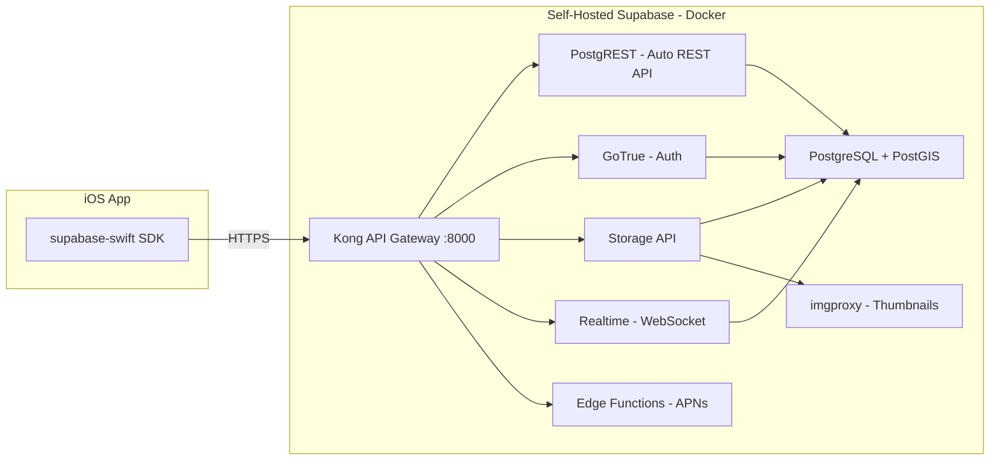

# Self-Hosted Supabase Backend for CameraApp

## How Supabase Replaces a Custom API

Supabase auto-generates a REST API from your PostgreSQL schema via **PostgREST**. Every table, view, and database function you create is immediately available as an API endpoint. The official **supabase-swift** SDK (v2+, installed via SPM) provides a type-safe Swift client that talks to this API. This means:

- **No custom API server to write or maintain**
- Database schema changes are instantly reflected in the API
- Row Level Security (RLS) enforces access control at the database level
- The Swift SDK handles Auth, queries, Storage, and Realtime natively




---

## Phase 1: Infrastructure -- New Repo and Self-Hosted Supabase

### 1.1 Create the backend repo

Create a new repo (e.g. `ios-app-backend`) with this structure:

```
ios-app-backend/
  supabase/
    docker-compose.yml      # from Supabase official repo
    .env                    # secrets (gitignored)
    .env.example            # template with placeholder values
    volumes/
      functions/            # Edge Functions (Deno/TypeScript)
  migrations/
    001_enable_extensions.sql
    002_create_tables.sql
    003_create_rls_policies.sql
    004_create_db_functions.sql
    005_seed_data.sql
  scripts/
    generate-keys.sh
    deploy.sh
  Makefile
  README.md
  .gitignore
```

### 1.2 Deploy self-hosted Supabase via Docker Compose

Follow the official process: clone the Supabase repo, copy the `docker/` contents, configure `.env` with real secrets (JWT_SECRET, ANON_KEY, SERVICE_ROLE_KEY, POSTGRES_PASSWORD, etc.), then `docker compose up -d`.

Services included out of the box:

- **Kong** -- API gateway (port 8000)
- **PostgREST** -- auto-generated REST API from schema
- **GoTrue (Auth)** -- JWT-based auth (signup, login, sessions)
- **Storage** -- file/image upload and serving (S3-compatible)
- **imgproxy** -- on-the-fly image resizing and thumbnails
- **Realtime** -- WebSocket server for live database change subscriptions
- **Edge Runtime** -- Deno-based serverless functions (for push notifications)
- **PostgreSQL** -- the database
- **Supavisor** -- connection pooler
- **Studio** -- admin dashboard

Minimum server: **4 GB RAM, 2 CPU cores, 50 GB SSD** (a $20-24/mo VPS).

---

## Phase 2: Database Schema and PostGIS

### 2.1 Enable extensions

```sql
-- migrations/001_enable_extensions.sql
CREATE EXTENSION IF NOT EXISTS postgis WITH SCHEMA extensions;
CREATE EXTENSION IF NOT EXISTS "uuid-ossp" WITH SCHEMA extensions;
```

### 2.2 Core tables

These map directly to the existing models in `CameraApp/Models/`:

```sql
-- migrations/002_create_tables.sql

-- Users (extends Supabase auth.users)
CREATE TABLE public.profiles (
    id          UUID PRIMARY KEY REFERENCES auth.users(id) ON DELETE CASCADE,
    username    TEXT UNIQUE NOT NULL,
    display_name TEXT NOT NULL,
    bio         TEXT DEFAULT '',
    gradient_colors TEXT[] DEFAULT '{}',
    created_at  TIMESTAMPTZ DEFAULT now()
);

-- Posts (maps to ImagePost model)
CREATE TABLE public.posts (
    id            UUID PRIMARY KEY DEFAULT gen_random_uuid(),
    user_id       UUID REFERENCES public.profiles(id) ON DELETE CASCADE NOT NULL,
    image_path    TEXT NOT NULL,
    caption       TEXT DEFAULT '',
    location      GEOGRAPHY(Point, 4326) NOT NULL,
    location_name TEXT DEFAULT '',
    scope         TEXT CHECK (scope IN ('private', 'friends', 'public')) NOT NULL DEFAULT 'public',
    created_at    TIMESTAMPTZ DEFAULT now()
);
CREATE INDEX idx_posts_location ON public.posts USING GIST(location);
CREATE INDEX idx_posts_created ON public.posts(created_at DESC);
CREATE INDEX idx_posts_user ON public.posts(user_id);

-- Friendships (maps to FriendsStore)
CREATE TABLE public.friendships (
    requester_id UUID REFERENCES public.profiles(id) ON DELETE CASCADE,
    addressee_id UUID REFERENCES public.profiles(id) ON DELETE CASCADE,
    status       TEXT CHECK (status IN ('pending', 'accepted')) NOT NULL DEFAULT 'pending',
    created_at   TIMESTAMPTZ DEFAULT now(),
    PRIMARY KEY (requester_id, addressee_id)
);

-- Likes
CREATE TABLE public.likes (
    user_id  UUID REFERENCES public.profiles(id) ON DELETE CASCADE,
    post_id  UUID REFERENCES public.posts(id) ON DELETE CASCADE,
    created_at TIMESTAMPTZ DEFAULT now(),
    PRIMARY KEY (user_id, post_id)
);

-- Pins (pin to profile)
CREATE TABLE public.pins (
    user_id  UUID REFERENCES public.profiles(id) ON DELETE CASCADE,
    post_id  UUID REFERENCES public.posts(id) ON DELETE CASCADE,
    created_at TIMESTAMPTZ DEFAULT now(),
    PRIMARY KEY (user_id, post_id)
);

-- Moments (maps to Moment model)
CREATE TABLE public.moments (
    id            UUID PRIMARY KEY DEFAULT gen_random_uuid(),
    user_id       UUID REFERENCES public.profiles(id) ON DELETE CASCADE NOT NULL,
    location      GEOGRAPHY(Point, 4326) NOT NULL,
    location_name TEXT DEFAULT '',
    moment_date   TIMESTAMPTZ NOT NULL,
    created_at    TIMESTAMPTZ DEFAULT now()
);

-- Push notification tokens
CREATE TABLE public.device_tokens (
    id         UUID PRIMARY KEY DEFAULT gen_random_uuid(),
    user_id    UUID REFERENCES public.profiles(id) ON DELETE CASCADE NOT NULL,
    token      TEXT NOT NULL,
    platform   TEXT DEFAULT 'ios',
    created_at TIMESTAMPTZ DEFAULT now(),
    UNIQUE(user_id, token)
);
```

### 2.3 Database functions for geospatial queries

PostgREST exposes PostgreSQL functions as RPC endpoints. This is how the Explore feature's proximity search works -- call it from Swift as `supabase.rpc("nearby_posts", params: ...)`:

```sql
-- migrations/004_create_db_functions.sql

CREATE OR REPLACE FUNCTION nearby_posts(
    lng DOUBLE PRECISION,
    lat DOUBLE PRECISION,
    radius_meters DOUBLE PRECISION DEFAULT 5000,
    start_date TIMESTAMPTZ DEFAULT NULL,
    end_date TIMESTAMPTZ DEFAULT NULL,
    max_results INT DEFAULT 50
)
RETURNS TABLE (
    id UUID,
    user_id UUID,
    username TEXT,
    display_name TEXT,
    gradient_colors TEXT[],
    image_path TEXT,
    caption TEXT,
    longitude DOUBLE PRECISION,
    latitude DOUBLE PRECISION,
    location_name TEXT,
    scope TEXT,
    created_at TIMESTAMPTZ,
    distance_meters DOUBLE PRECISION
)
LANGUAGE sql STABLE
SECURITY DEFINER
AS $$
    SELECT
        p.id, p.user_id, pr.username, pr.display_name, pr.gradient_colors,
        p.image_path, p.caption,
        ST_X(p.location::geometry) AS longitude,
        ST_Y(p.location::geometry) AS latitude,
        p.location_name, p.scope, p.created_at,
        ST_Distance(p.location, ST_MakePoint(lng, lat)::geography) AS distance_meters
    FROM public.posts p
    JOIN public.profiles pr ON p.user_id = pr.id
    WHERE ST_DWithin(p.location, ST_MakePoint(lng, lat)::geography, radius_meters)
      AND (start_date IS NULL OR p.created_at >= start_date)
      AND (end_date IS NULL OR p.created_at <= end_date)
      AND (
          p.scope = 'public'
          OR (p.scope = 'friends' AND EXISTS (
              SELECT 1 FROM public.friendships f
              WHERE f.status = 'accepted'
                AND ((f.requester_id = auth.uid() AND f.addressee_id = p.user_id)
                  OR (f.addressee_id = auth.uid() AND f.requester_id = p.user_id))
          ))
          OR p.user_id = auth.uid()
      )
    ORDER BY distance_meters ASC
    LIMIT max_results;
$$;
```

---

## Phase 3: Row Level Security (RLS)

RLS policies enforce all access control at the database level. PostgREST passes the authenticated user's JWT to Postgres, so `auth.uid()` identifies the caller in every query.

```sql
-- migrations/003_create_rls_policies.sql

-- Enable RLS on all tables
ALTER TABLE public.profiles ENABLE ROW LEVEL SECURITY;
ALTER TABLE public.posts ENABLE ROW LEVEL SECURITY;
ALTER TABLE public.friendships ENABLE ROW LEVEL SECURITY;
ALTER TABLE public.likes ENABLE ROW LEVEL SECURITY;
ALTER TABLE public.pins ENABLE ROW LEVEL SECURITY;
ALTER TABLE public.moments ENABLE ROW LEVEL SECURITY;
ALTER TABLE public.device_tokens ENABLE ROW LEVEL SECURITY;

-- PROFILES: anyone can read, owner can update
CREATE POLICY "Profiles are viewable by everyone"
    ON public.profiles FOR SELECT TO authenticated USING (true);
CREATE POLICY "Users can update own profile"
    ON public.profiles FOR UPDATE TO authenticated
    USING (id = auth.uid()) WITH CHECK (id = auth.uid());

-- POSTS: scope-aware visibility
CREATE POLICY "Posts visible by scope"
    ON public.posts FOR SELECT TO authenticated
    USING (
        scope = 'public'
        OR user_id = auth.uid()
        OR (scope = 'friends' AND EXISTS (
            SELECT 1 FROM public.friendships
            WHERE status = 'accepted'
              AND ((requester_id = auth.uid() AND addressee_id = user_id)
                OR (addressee_id = auth.uid() AND requester_id = user_id))
        ))
    );
CREATE POLICY "Users can insert own posts"
    ON public.posts FOR INSERT TO authenticated
    WITH CHECK (user_id = auth.uid());
CREATE POLICY "Users can delete own posts"
    ON public.posts FOR DELETE TO authenticated
    USING (user_id = auth.uid());

-- FRIENDSHIPS: involved parties can read, requester can insert/delete
CREATE POLICY "Users can see own friendships"
    ON public.friendships FOR SELECT TO authenticated
    USING (requester_id = auth.uid() OR addressee_id = auth.uid());
CREATE POLICY "Users can send friend requests"
    ON public.friendships FOR INSERT TO authenticated
    WITH CHECK (requester_id = auth.uid());
CREATE POLICY "Users can manage own friendships"
    ON public.friendships FOR UPDATE TO authenticated
    USING (addressee_id = auth.uid());
CREATE POLICY "Users can remove friendships"
    ON public.friendships FOR DELETE TO authenticated
    USING (requester_id = auth.uid() OR addressee_id = auth.uid());

-- LIKES, PINS, MOMENTS, DEVICE_TOKENS: owner-only
CREATE POLICY "Users manage own likes"
    ON public.likes FOR ALL TO authenticated
    USING (user_id = auth.uid()) WITH CHECK (user_id = auth.uid());
CREATE POLICY "Users manage own pins"
    ON public.pins FOR ALL TO authenticated
    USING (user_id = auth.uid()) WITH CHECK (user_id = auth.uid());
CREATE POLICY "Users manage own moments"
    ON public.moments FOR ALL TO authenticated
    USING (user_id = auth.uid()) WITH CHECK (user_id = auth.uid());
CREATE POLICY "Users manage own device tokens"
    ON public.device_tokens FOR ALL TO authenticated
    USING (user_id = auth.uid()) WITH CHECK (user_id = auth.uid());
```

---

## Phase 4: Storage (Image Uploads)

Supabase Storage handles image uploads with built-in access control via Storage policies. The self-hosted stack stores files locally by default (configurable to S3).

- Create a `**post-images**` bucket
- Configure a Storage policy: authenticated users can upload to their own folder (`{user_id}/`), public read for public/friends posts
- **imgproxy** (included in Docker Compose) handles thumbnail generation on-the-fly via URL transforms

From Swift, uploading an image looks like:

```swift
let imageData = photo.jpegData(compressionQuality: 0.8)!
let path = "\(userId)/\(postId).jpg"
try await supabase.storage.from("post-images").upload(path, data: imageData, options: .init(contentType: "image/jpeg"))
```

---

## Phase 5: Auth

Supabase GoTrue handles all authentication. The Swift SDK provides:

```swift
// Sign up
try await supabase.auth.signUp(email: email, password: password)

// Sign in
try await supabase.auth.signIn(email: email, password: password)

// Session persists automatically; listen for auth state changes
for await state in supabase.auth.authStateChanges { ... }
```

A **database trigger** should auto-create a `profiles` row when a new user signs up:

```sql
CREATE OR REPLACE FUNCTION handle_new_user()
RETURNS TRIGGER AS $$
BEGIN
    INSERT INTO public.profiles (id, username, display_name)
    VALUES (NEW.id, NEW.raw_user_meta_data->>'username', NEW.raw_user_meta_data->>'display_name');
    RETURN NEW;
END;
$$ LANGUAGE plpgsql SECURITY DEFINER;

CREATE TRIGGER on_auth_user_created
    AFTER INSERT ON auth.users
    FOR EACH ROW EXECUTE FUNCTION handle_new_user();
```

---

## Phase 6: Realtime Subscriptions

Supabase Realtime listens to Postgres changes and pushes them over WebSocket. Useful for:

- New friend requests appearing instantly
- Like counts updating live
- New posts in the current Explore view

From Swift:

```swift
let channel = supabase.realtime.channel("friend-requests")
let changes = channel.postgresChange(InsertAction.self, schema: "public", table: "friendships", filter: "addressee_id=eq.\(userId)")
await channel.subscribe()
for await change in changes { ... }
```

---

## Phase 7: Push Notifications via Edge Functions

An Edge Function (Deno/TypeScript) can be triggered by a database webhook to send APNs push notifications when a friend request or like occurs. This runs inside the self-hosted stack (no external push service needed except Apple's APNs).

```
volumes/functions/push-notification/index.ts
```

The function receives the webhook payload (e.g., new row in `friendships`), looks up the target user's device token, and sends to APNs using the HTTP/2 provider API with your `.p8` key.

---

## Phase 8: iOS App Integration

### 8.1 Add supabase-swift via SPM

Add `https://github.com/supabase/supabase-swift` (from version `2.0.0`) to the project. Include products: `Supabase` (bundles Auth, PostgREST, Realtime, Storage, Functions).

Update [project.yml](project.yml) to include the SPM dependency.

### 8.2 Create a Supabase client singleton

A new `Services/SupabaseManager.swift` file:

```swift
import Supabase

enum SupabaseManager {
    static let client = SupabaseClient(
        supabaseURL: URL(string: "https://your-server:8000")!,
        supabaseKey: "your-anon-key"
    )
}
```

### 8.3 Refactor existing code

Each existing component maps to a Supabase operation:


| Current Code                                                                                                       | Change Required                                                      |
| ------------------------------------------------------------------------------------------------------------------ | -------------------------------------------------------------------- |
| `ImagePost.samplePosts()` in [ExploreViewModel.swift](CameraApp/ViewModels/ExploreViewModel.swift)                 | Replace with `supabase.rpc("nearby_posts", params: ...)`             |
| `ImagePost.sampleUserPosts()` in [FriendProfileViewModel.swift](CameraApp/ViewModels/FriendProfileViewModel.swift) | Replace with `supabase.from("posts").select().eq("user_id", userId)` |
| `FriendsStore` local arrays in [FriendsStore.swift](CameraApp/Stores/FriendsStore.swift)                           | Replace with queries/inserts/updates on `friendships` table          |
| `MomentsStore` local array in [MomentsStore.swift](CameraApp/Stores/MomentsStore.swift)                            | Replace with queries/inserts on `moments` table                      |
| Like/pin local Sets in [PostDetailViewModel.swift](CameraApp/ViewModels/PostDetailViewModel.swift)                 | Replace with insert/delete on `likes`/`pins` tables                  |
| `User.currentUser` hardcoded in [User.swift](CameraApp/Models/User.swift)                                          | Replace with `supabase.auth.session.user`                            |
| Camera capture in [PostPreviewView.swift](CameraApp/Views/Camera/PostPreviewView.swift)                            | Add Storage upload on post creation                                  |
| No login/signup screens                                                                                            | Add new Auth views (login, signup, profile setup)                    |


### 8.4 Update models

The existing `User`, `ImagePost`, `Moment` models in `CameraApp/Models/` need to be updated to conform to `Codable` and match the database column names so the Swift SDK can decode responses directly.

---

## Cost Estimate


| Item                                         | Monthly Cost                  |
| -------------------------------------------- | ----------------------------- |
| VPS (4GB RAM, 2 CPU, 80GB SSD)               | $20-24                        |
| Domain + TLS (via Caddy/Let's Encrypt)       | $1 (domain only)              |
| SMTP for auth emails (AWS SES or equivalent) | ~$0-1                         |
| Apple Developer Program (for APNs)           | $8.25 (amortized from $99/yr) |
| **Total**                                    | **~$30/mo**                   |


No per-user, per-request, or per-GB-stored third-party fees. You own the entire stack.